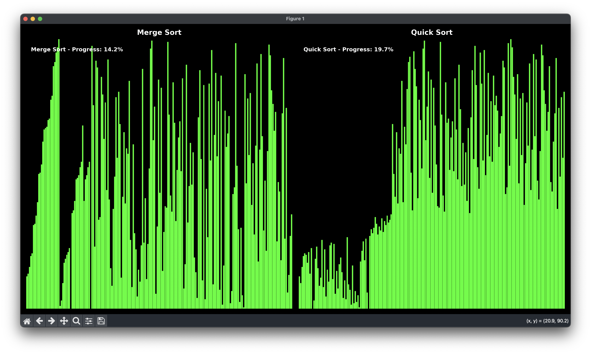
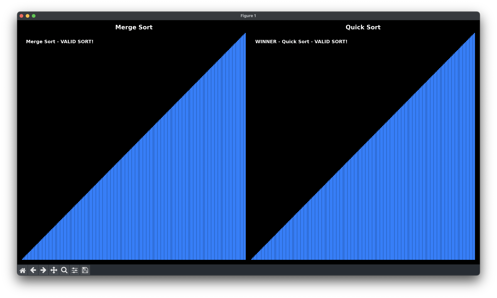

# 🎯 Sorting Algorithms Visualizer

**Advanced Python visualization tool for comparing sorting algorithms with real-time animation and performance analysis.**


## 🌟 Features

- **🎛️ Customizable Bar Count**: Choose between 10-200 bars for visualization
- **📊 11 Sorting Algorithms**: Compare any two algorithms side-by-side
- **⚡ Real-time Performance**: Algorithms finish proportionally to their actual speed
- **🔍 Validation System**: Automatic correctness verification with visual feedback
- **🏆 Winner Detection**: Fastest algorithm automatically marked as winner
- **🎨 Beautiful UI**: Green bars on black background with intuitive color coding

## 🎮 Demo & Screenshots

### 📸 Live Animation Examples

**Merge Sort vs Quick Sort - Animation in Progress**

*Real-time sorting animation showing progress percentages and algorithm comparison*

**Final Results with Validation**

*Completed sorting with winner announcement and validation (blue bars indicate successful sorting)*

### 💻 Console Output Example

```
🚀 ADVANCED SORTING ALGORITHM VISUALIZER
==================================================
Enter number of bars (10-200): 100
✅ Will create 100 bars with heights from 1 to 100

📊 Available sorting algorithms:
  1 . Bubble Sort     7 . Comb Sort
  2 . Selection Sort  8 . Radix Sort  
  3 . Insertion Sort  9 . Bucket Sort
  4 . Quick Sort     10. Bogo Sort
  5 . Heap Sort      11. Merge Sort
  6 . Shell Sort

🏆 WINNER: Quick Sort (fastest algorithm)
⚡ Algorithms finish at different times based on performance
```

## 🔧 Installation

### Prerequisites
- Python 3.8 or higher
- pip package manager

### Install Dependencies
```bash
pip install matplotlib
```

### Clone Repository
```bash
git clone https://github.com/ahmertsengol/SortingAlgorithms.git
cd SortingAlgorithms
```

## 🚀 Usage

### Basic Usage
```bash
python SortingVisualizer.py
```

### Step-by-Step
1. **Choose bar count** (10-200 range)
2. **Select first algorithm** (1-11)
3. **Select second algorithm** (different from first)
4. **Watch the visualization!**

## 📊 Supported Algorithms

| Algorithm | Best Case | Average Case | Worst Case | Space Complexity |
|-----------|-----------|--------------|------------|------------------|
| Bubble Sort | O(n) | O(n²) | O(n²) | O(1) |
| Selection Sort | O(n²) | O(n²) | O(n²) | O(1) |
| Insertion Sort | O(n) | O(n²) | O(n²) | O(1) |
| Quick Sort | O(n log n) | O(n log n) | O(n²) | O(log n) |
| Heap Sort | O(n log n) | O(n log n) | O(n log n) | O(1) |
| Shell Sort | O(n log n) | O(n^1.25) | O(n²) | O(1) |
| Comb Sort | O(n log n) | O(n²) | O(n²) | O(1) |
| Radix Sort | O(nk) | O(nk) | O(nk) | O(n+k) |
| Bucket Sort | O(n+k) | O(n+k) | O(n²) | O(n) |
| Bogo Sort | O(n) | O((n+1)!) | O(∞) | O(1) |
| Merge Sort | O(n log n) | O(n log n) | O(n log n) | O(n) |

## 🎨 Visual Elements

### Color Coding
- **🟢 Green**: Normal bars (as seen in Example-1.png during sorting)
- **⚫ Black**: Currently selected/comparing bars (visible during animation)
- **🔵 Blue**: Validated correct sorting (as shown in Example-2.png after completion)
- **🔴 Red**: Validation errors (if any)

### Animation Phases
1. **Sorting Phase**: Real-time algorithm execution with progress tracking (Example-1.png)
2. **Validation Phase**: Correctness verification with color change to blue
3. **Results**: Winner announcement and final status (Example-2.png)

## 🏗️ Project Structure

```
SortingAlgorithms/
├── SortingVisualizer.py    # Main application
├── README.md              # Project documentation
├── requirements.txt       # Dependencies
├── LICENSE               # MIT License
├── CHANGELOG.md          # Version history
├── .gitignore           # Git excludes
├── images/              # Screenshots and visual examples
│   ├── Example-1.png    # Animation in progress
│   └── Example-2.png    # Validation complete
└── examples/            # Sample outputs and documentation
    └── SAMPLE_OUTPUT.md # Usage examples
```

## 🤝 Contributing

1. Fork the repository
2. Create your feature branch (`git checkout -b feature/AmazingFeature`)
3. Commit your changes (`git commit -m 'Add some AmazingFeature'`)
4. Push to the branch (`git push origin feature/AmazingFeature`)
5. Open a Pull Request

## 📈 Performance Insights

The visualizer provides real-time performance comparison:
- **Frame-based timing**: Algorithms finish proportionally to their complexity
- **Winner detection**: Fastest algorithm automatically identified
- **Validation system**: Ensures sorting correctness

## 🐛 Known Issues

- Font warnings on some systems (cosmetic only)
- Bogo Sort limited to 1000 iterations for practical purposes

## 📝 License

This project is licensed under the MIT License - see the [LICENSE](LICENSE) file for details.

## 👨‍💻 Author

**Ahmet Şengöl**
- GitHub: [@ahmertsengol](https://github.com/ahmertsengol)

## 🙏 Acknowledgments

- Matplotlib for visualization capabilities
- Python community for excellent documentation
- Computer Science algorithms research

## 📞 Support

If you have any questions or run into issues, please open an issue on GitHub or contact me directly.

---

⭐ **Star this repository if you found it helpful!** ⭐ 